# Room Rental Management Software - System Report

This document describes the current Room Rental Management Software system in English. It covers the system scope, actors, use cases, requirements, architecture, data design, workflows, diagrams, security design, test plan, and future improvements.

The diagrams are provided in two forms:

- Mermaid diagrams, which can be rendered by Markdown tools that support Mermaid.
- LLM-readable diagram specifications, which describe nodes, edges, states, and interactions in plain structured text so another language model can understand or redraw the diagrams even without Mermaid rendering.

## 1. System Overview

### 1.1 Purpose

Room Rental Management Software is an internal web application for managing a small room rental business. It helps an admin or landlord manage rooms, tenants, rental contracts, monthly invoices, manual payment confirmations, and maintenance requests.

The main purpose is to replace manual tracking with a centralized web system. The system also gives tenants a personal portal where they can view their own contract, invoices, payments, and maintenance request history.

### 1.2 Scope

The current system supports two roles:

- `ADMIN`: manages all rental business data and operational workflows.
- `TENANT`: views only personal rental data and submits maintenance requests.

Implemented modules:

- Authentication and role-based authorization.
- Admin dashboard.
- Room management.
- Tenant management.
- Contract management.
- Invoice management.
- Payment confirmation.
- Maintenance request management.
- Tenant portal.

Explicitly excluded from the current scope:

- Public room listing.
- Online booking.
- Payment gateway integration.
- Automatic bank transfer verification.
- Full electronic contract signing.
- PDF invoice export.
- Staff or manager role.

### 1.3 Technology Stack

| Layer | Technology |
| --- | --- |
| Frontend | React, React Router, Axios, Vite |
| Backend | Node.js, Express.js |
| Authentication | JWT, bcryptjs |
| Authorization | Role-based access control |
| Data layer | MongoDB with Mongoose models |
| Testing | Node built-in test runner |
| Build tooling | npm workspaces, Vite |

## 2. Stakeholders And Actors

### 2.1 Stakeholders

| Stakeholder | Main Needs |
| --- | --- |
| Admin / Landlord | Manage rooms, tenants, contracts, invoices, payments, maintenance requests, and dashboard statistics |
| Tenant | View personal rental information, invoices, payment history, and submit maintenance requests |
| Developer / Maintainer | Maintain source code, validate business rules, run tests, configure deployment |

### 2.2 Actor Permission Table

| Function | Admin | Tenant |
| --- | --- | --- |
| Login and logout | Yes | Yes |
| View dashboard | Admin dashboard | Personal dashboard |
| Manage rooms | Yes | No |
| Manage tenants | Yes | No |
| Manage contracts | Yes | View own contracts only |
| Manage invoices | Yes | View own invoices only |
| Confirm payments | Yes | No |
| View payment history | All payments | Own payments only |
| Manage maintenance requests | Review and update all requests | Create and view own requests |

## 3. Use Case Model

### 3.1 Use Case Diagram

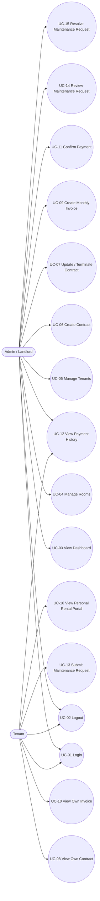

LLM-readable diagram specification:

```text
Diagram type: Use case diagram.
Actors:
- Admin / Landlord
- Tenant
Use cases:
- UC-01 Login
- UC-02 Logout
- UC-03 View Dashboard
- UC-04 Manage Rooms
- UC-05 Manage Tenants
- UC-06 Create Contract
- UC-07 Update / Terminate Contract
- UC-08 View Own Contract
- UC-09 Create Monthly Invoice
- UC-10 View Own Invoice
- UC-11 Confirm Payment
- UC-12 View Payment History
- UC-13 Submit Maintenance Request
- UC-14 Review Maintenance Request
- UC-15 Resolve Maintenance Request
- UC-16 View Personal Rental Portal
Associations:
- Admin connects to UC-01, UC-02, UC-03, UC-04, UC-05, UC-06, UC-07, UC-09, UC-11, UC-12, UC-14, UC-15.
- Tenant connects to UC-01, UC-02, UC-08, UC-10, UC-12, UC-13, UC-16.
```

### 3.2 Use Case List

| ID | Use Case | Actor | Description |
| --- | --- | --- | --- |
| UC-01 | Login | Admin, Tenant | User enters credentials and receives a JWT token |
| UC-02 | Logout | Admin, Tenant | User ends the current local session |
| UC-03 | View Dashboard | Admin | Admin views system statistics |
| UC-04 | Manage Rooms | Admin | Admin creates, reads, updates, and deletes rooms |
| UC-05 | Manage Tenants | Admin | Admin creates, reads, updates, and deletes tenant profiles |
| UC-06 | Create Contract | Admin | Admin assigns a tenant to a room through a rental contract |
| UC-07 | Update / Terminate Contract | Admin | Admin updates contract data or terminates a contract |
| UC-08 | View Own Contract | Tenant | Tenant views personal contracts |
| UC-09 | Create Monthly Invoice | Admin | Admin creates a monthly invoice for an active contract |
| UC-10 | View Own Invoice | Tenant | Tenant views personal invoices |
| UC-11 | Confirm Payment | Admin | Admin records a manual payment confirmation |
| UC-12 | View Payment History | Admin, Tenant | Admin views all payments; tenant views own payments |
| UC-13 | Submit Maintenance Request | Tenant | Tenant creates a maintenance request for the rented room |
| UC-14 | Review Maintenance Request | Admin | Admin accepts or rejects a maintenance request |
| UC-15 | Resolve Maintenance Request | Admin | Admin marks an accepted request as resolved |
| UC-16 | View Personal Rental Portal | Tenant | Tenant views the personal rental portal |

### 3.3 Detailed Use Cases

#### UC-01 - Login

| Field | Description |
| --- | --- |
| Primary actor | Admin, Tenant |
| Preconditions | The account exists and is active |
| Main flow | User submits login ID and password; backend validates the password with bcrypt; backend signs a JWT; frontend stores the session and redirects by role |
| Alternate flow | Invalid credentials return `401 Unauthorized` |
| Postconditions | User enters either the admin portal or tenant portal |

#### UC-06 - Create Contract

| Field | Description |
| --- | --- |
| Primary actor | Admin |
| Preconditions | Tenant exists, room exists, and room is `Available` |
| Main flow | Admin selects tenant and room, enters contract dates, deposit, rent, status, image URL, and note; backend validates and creates the contract |
| Business rules | Only one active contract is allowed per room; active contract changes room status to `Occupied` |
| Postconditions | Contract is saved and room status is synchronized |

#### UC-09 - Create Monthly Invoice

| Field | Description |
| --- | --- |
| Primary actor | Admin |
| Preconditions | An active contract exists |
| Main flow | Admin selects contract, enters billing month, utility data, fees, discount, and due date |
| Business rules | Invoice tenant and room must match the selected contract; duplicate tenant/month invoices are rejected; invoice cannot be marked `Paid` directly |
| Postconditions | Invoice is saved with calculated total amount |

#### UC-11 - Confirm Payment

| Field | Description |
| --- | --- |
| Primary actor | Admin |
| Preconditions | Invoice exists and is not `Paid` or `Cancelled` |
| Main flow | Admin selects invoice, system fills tenant and total amount, admin confirms method and payment date |
| Business rules | Payment tenant must match invoice tenant; payment amount must match invoice total |
| Postconditions | Payment record is created and invoice status becomes `Paid` |

#### UC-13 - Submit Maintenance Request

| Field | Description |
| --- | --- |
| Primary actor | Tenant |
| Preconditions | Tenant has an active contract for the selected room |
| Main flow | Tenant selects room, enters title and description, backend creates request as `Pending Review` |
| Business rules | Tenant can only submit requests for rooms connected to their own active contract |
| Postconditions | Admin can see the request in the maintenance management page |

## 4. Requirements

### 4.1 Functional Requirements

| ID | Requirement |
| --- | --- |
| FR-01 | The system shall allow admin and tenant users to log in with stored credentials |
| FR-02 | The system shall identify user role after login |
| FR-03 | The system shall redirect users to the correct portal by role |
| FR-04 | The system shall protect API endpoints with JWT authentication |
| FR-05 | The system shall block tenants from admin-only APIs |
| FR-06 | Admin shall be able to create, read, update, and delete rooms |
| FR-07 | A room shall store room number, floor, room type, monthly rent, max occupants, status, and description |
| FR-08 | Room number shall be unique |
| FR-09 | Room status shall be one of `Available`, `Occupied`, `Maintenance` |
| FR-10 | A room with an active contract shall not be manually changed to `Available` or `Maintenance` |
| FR-11 | Admin shall be able to create tenant accounts and tenant profiles |
| FR-12 | Tenant profile shall store full name, phone, email, identity number, date of birth, and hometown |
| FR-13 | Tenant password shall be hashed before storage |
| FR-14 | Tenant phone and identity number shall be unique |
| FR-15 | Admin shall be able to create contracts connecting one tenant to one room |
| FR-16 | Contract shall store dates, deposit, rent, status, image URL, and note |
| FR-17 | The system shall prevent more than one active contract for the same room |
| FR-18 | The system shall update room status when contract status changes |
| FR-19 | Admin shall be able to create monthly invoices for active contracts |
| FR-20 | The system shall calculate electricity fee |
| FR-21 | The system shall calculate water fee using `BY_USAGE` or `BY_PERSON` |
| FR-22 | The system shall calculate total invoice amount |
| FR-23 | Tenant shall only view own invoices |
| FR-24 | Admin shall be able to confirm payments manually |
| FR-25 | The system shall create payment records |
| FR-26 | The system shall update invoice status to `Paid` after payment confirmation |
| FR-27 | Tenant shall only view own payment history |
| FR-28 | Tenant shall be able to create maintenance requests for rented rooms |
| FR-29 | Admin shall be able to review, accept, reject, and resolve maintenance requests |
| FR-30 | Rejected maintenance requests shall require a response note |
| FR-31 | Resolved maintenance requests shall contain resolved time |
| FR-32 | Admin dashboard shall show room, tenant, invoice, and revenue statistics |
| FR-33 | Tenant dashboard shall show personal invoice and billing summary |

### 4.2 Non-Functional Requirements

| ID | Requirement |
| --- | --- |
| NFR-01 | Usability: the interface should be simple enough for normal users and course demonstration |
| NFR-02 | Security: passwords must not be stored in plain text; protected APIs require JWT |
| NFR-03 | Authorization: tenant data access must be restricted to the logged-in tenant |
| NFR-04 | Reliability: contract, invoice, payment, and maintenance state transitions must remain consistent |
| NFR-05 | Maintainability: code should separate route, controller, service, model, middleware, and data layers |
| NFR-06 | Performance: list pages and dashboard should load quickly for small to medium local datasets |
| NFR-07 | Portability: the current build should run locally with Node.js and npm |
| NFR-08 | Testability: critical business rules should have automated tests |

## 5. System Architecture

### 5.1 Architecture Overview

The system uses client-server architecture and layered architecture.

- The React frontend handles routes, screens, forms, local authentication state, and API calls.
- The Express backend handles authentication, authorization, controllers, business rules, and data access.
- The data layer uses Mongoose models backed by MongoDB.

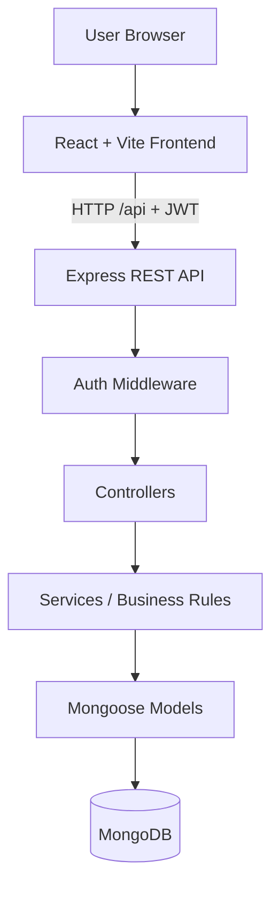

LLM-readable diagram specification:

```text
Diagram type: High-level architecture.
Nodes:
- User Browser
- React + Vite Frontend
- Express REST API
- Auth Middleware
- Controllers
- Services / Business Rules
- Repository Models
- Local JSON Store
Edges:
- User Browser sends UI interactions to React + Vite Frontend.
- React + Vite Frontend sends HTTP /api requests with JWT to Express REST API.
- Express REST API passes protected requests through Auth Middleware.
- Auth Middleware allows requests to Controllers.
- Controllers call Services.
- Services call Repository Models.
- Repository Models read and write Local JSON Store.
```

### 5.2 Layered Architecture

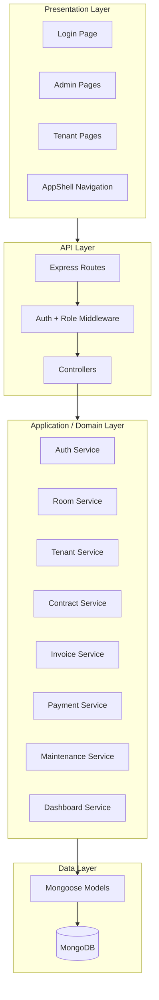

LLM-readable diagram specification:

```text
Diagram type: Layered architecture.
Layers:
1. Presentation Layer:
   - Login Page
   - Admin Pages
   - Tenant Pages
   - AppShell Navigation
2. API Layer:
   - Express Routes
   - Auth + Role Middleware
   - Controllers
3. Application / Domain Layer:
   - Auth Service
   - Room Service
   - Tenant Service
   - Contract Service
   - Invoice Service
   - Payment Service
   - Maintenance Service
   - Dashboard Service
4. Data Layer:
   - Mongoose Models
   - MongoDB
Flow:
- Presentation Layer calls API Layer.
- Express Routes call Middleware.
- Middleware calls Controllers.
- Controllers call Services.
- Services call Mongoose models.
- Mongoose models persist data in MongoDB.
```

### 5.3 Deployment Diagram

Current local/demo deployment:

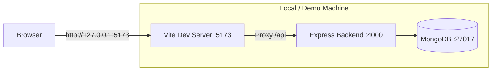

LLM-readable diagram specification:

```text
Diagram type: Deployment diagram for current local build.
Runtime environment: One local development machine.
Nodes:
- Browser
- Vite Dev Server on port 5173
- Express Backend on port 4000
- MongoDB on port 27017 or a configured remote MongoDB URI
Edges:
- Browser opens http://127.0.0.1:5173 served by Vite.
- Vite proxies /api requests to Express Backend.
- Express Backend reads and writes MongoDB through Mongoose.
```

Target production deployment:

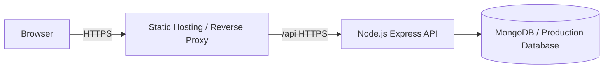

LLM-readable diagram specification:

```text
Diagram type: Target production deployment.
Nodes:
- Browser
- Static Hosting or Reverse Proxy
- Node.js Express API
- MongoDB or production database
Edges:
- Browser accesses Static Hosting or Reverse Proxy through HTTPS.
- Static Hosting or Reverse Proxy forwards /api requests to Node.js Express API through HTTPS or internal network.
- Node.js Express API reads and writes MongoDB or another production database.
```

### 5.4 Backend Module Map

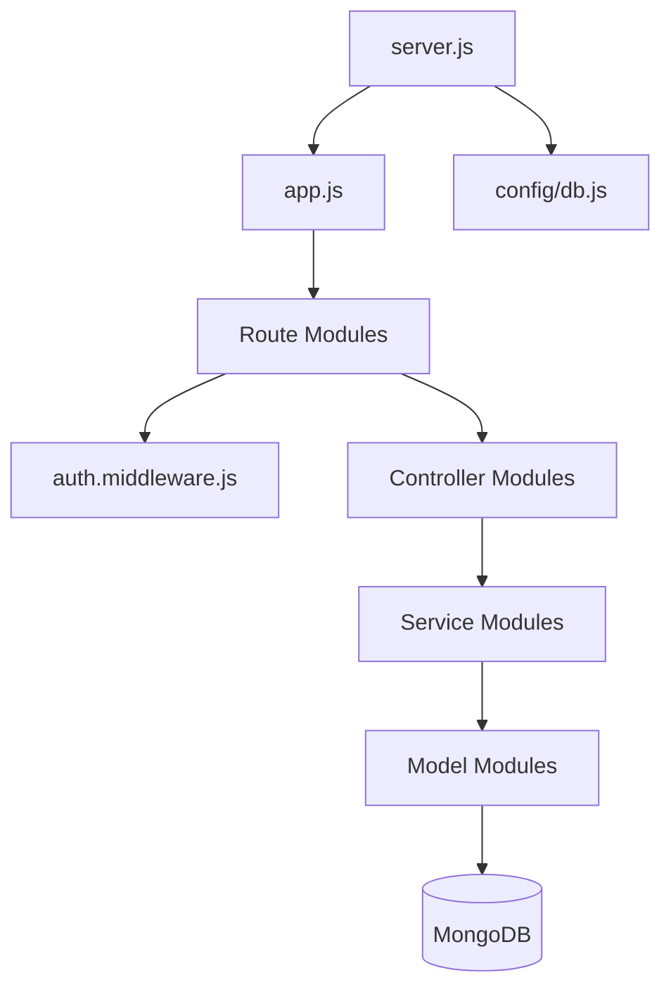

LLM-readable diagram specification:

```text
Diagram type: Backend module dependency map.
Modules:
- server.js starts backend and initializes MongoDB.
- app.js configures Express middleware and mounts route modules.
- route modules define URL endpoints and role restrictions.
- auth.middleware.js verifies JWT and checks roles.
- controller modules translate HTTP requests into service calls.
- service modules contain business rules and validation.
- model modules define Mongoose schemas and provide collection access.
- MongoDB persists application data.
Dependency direction:
server.js -> config/db.js
server.js -> app.js
app.js -> route modules
route modules -> auth.middleware.js
route modules -> controller modules
controller modules -> service modules
service modules -> model modules
model modules -> MongoDB
```

### 5.5 Frontend Route Map

```mermaid
flowchart TB
  App[App.jsx]
  AuthProvider[AuthProvider]
  RequireAuth[RequireAuth]
  Login[/login]

  Admin[/admin]
  AdminRooms[/admin/rooms]
  AdminTenants[/admin/tenants]
  AdminContracts[/admin/contracts]
  AdminInvoices[/admin/invoices]
  AdminPayments[/admin/payments]
  AdminMaintenance[/admin/maintenance]

  Tenant[/tenant]
  TenantContract[/tenant/contract]
  TenantInvoices[/tenant/invoices]
  TenantPayments[/tenant/payments]
  TenantMaintenance[/tenant/maintenance]

  App --> AuthProvider
  AuthProvider --> Login
  AuthProvider --> RequireAuth
  RequireAuth --> Admin
  RequireAuth --> Tenant
  Admin --> AdminRooms
  Admin --> AdminTenants
  Admin --> AdminContracts
  Admin --> AdminInvoices
  Admin --> AdminPayments
  Admin --> AdminMaintenance
  Tenant --> TenantContract
  Tenant --> TenantInvoices
  Tenant --> TenantPayments
  Tenant --> TenantMaintenance
```

LLM-readable diagram specification:

```text
Diagram type: Frontend routing map.
Root:
- App.jsx wraps routes in AuthProvider.
Public route:
- /login -> LoginPage.
Protected admin route:
- RequireAuth(role=ADMIN) -> AppShell -> /admin routes.
- /admin -> AdminDashboardPage.
- /admin/rooms -> AdminRoomsPage.
- /admin/tenants -> AdminTenantsPage.
- /admin/contracts -> AdminContractsPage.
- /admin/invoices -> AdminInvoicesPage.
- /admin/payments -> AdminPaymentsPage.
- /admin/maintenance -> AdminMaintenancePage.
Protected tenant route:
- RequireAuth(role=TENANT) -> AppShell -> /tenant routes.
- /tenant -> TenantDashboardPage.
- /tenant/contract -> TenantContractPage.
- /tenant/invoices -> TenantInvoicesPage.
- /tenant/payments -> TenantPaymentsPage.
- /tenant/maintenance -> TenantMaintenancePage.
```

## 6. Data Design

### 6.1 Entity Relationship Diagram

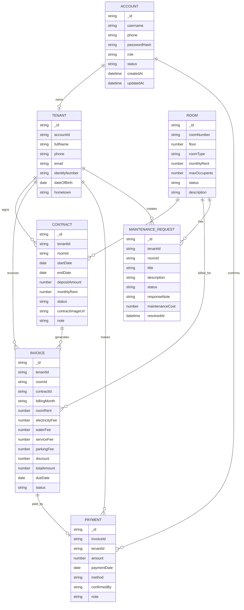

LLM-readable ERD specification:

```text
Entities:
1. Account
   Fields: _id, username, phone, passwordHash, role, status, createdAt, updatedAt.
2. Tenant
   Fields: _id, accountId, fullName, phone, email, identityNumber, dateOfBirth, hometown.
3. Room
   Fields: _id, roomNumber, floor, roomType, monthlyRent, maxOccupants, status, description.
4. Contract
   Fields: _id, tenantId, roomId, startDate, endDate, depositAmount, monthlyRent, status, contractImageUrl, note.
5. Invoice
   Fields: _id, tenantId, roomId, contractId, billingMonth, rent and utility fields, totalAmount, dueDate, status.
6. Payment
   Fields: _id, invoiceId, tenantId, amount, paymentDate, method, confirmedBy, note.
7. MaintenanceRequest
   Fields: _id, tenantId, roomId, title, description, status, responseNote, maintenanceCost, resolvedAt.
Relationships:
- Account 1 to 0..1 Tenant.
- Tenant 1 to many Contract.
- Room 1 to many Contract.
- Contract 1 to many Invoice.
- Tenant 1 to many Invoice.
- Room 1 to many Invoice.
- Invoice 1 to 0..1 Payment.
- Tenant 1 to many Payment.
- Account 1 to many Payment as confirmer.
- Tenant 1 to many MaintenanceRequest.
- Room 1 to many MaintenanceRequest.
Business constraint:
- A Room may have many contracts over time, but only one Active contract at the same time.
```

### 6.2 Data Dictionary

| Entity | Purpose | Key Fields |
| --- | --- | --- |
| Account | Stores login identity and role | username, phone, passwordHash, role, status |
| Tenant | Stores tenant profile | fullName, phone, email, identityNumber, dateOfBirth, hometown |
| Room | Stores room metadata and occupancy state | roomNumber, floor, roomType, monthlyRent, maxOccupants, status |
| Contract | Connects tenant and room | tenantId, roomId, startDate, endDate, depositAmount, monthlyRent, status |
| Invoice | Stores monthly billing data | billingMonth, utility fields, totalAmount, dueDate, status |
| Payment | Stores confirmed payment record | invoiceId, tenantId, amount, paymentDate, method, confirmedBy |
| MaintenanceRequest | Stores repair or support request | tenantId, roomId, title, description, status, responseNote |

## 7. Business Rules

| ID | Rule |
| --- | --- |
| BR-01 | Only Admin can manage rooms, tenants, contracts, invoices, payment confirmation, and maintenance review |
| BR-02 | Tenant can only view records linked to the tenant's own account |
| BR-03 | Room number must be unique |
| BR-04 | Tenant phone and identity number must be unique |
| BR-05 | A room can have at most one active contract |
| BR-06 | Active contract can only be created for an `Available` room |
| BR-07 | Creating an active contract changes room status to `Occupied` |
| BR-08 | Terminating or expiring an active contract may return the room to `Available` |
| BR-09 | Invoice can only be created for an active contract |
| BR-10 | Billing month must use `YYYY-MM` format |
| BR-11 | Duplicate invoice by tenant and billing month is rejected |
| BR-12 | Invoice total equals room rent plus electricity fee plus water fee plus service fee plus parking fee minus discount |
| BR-13 | Invoice cannot be marked `Paid` directly by invoice update |
| BR-14 | Payment tenant must match invoice tenant |
| BR-15 | Payment amount must match invoice total |
| BR-16 | Confirming payment creates a payment record and updates invoice status to `Paid` |
| BR-17 | Tenant can only submit maintenance request for a room in the tenant's active contract |
| BR-18 | Rejected maintenance request must include a response note |
| BR-19 | Resolved maintenance request automatically receives `resolvedAt` if missing |
| BR-20 | Room or tenant with related rental records cannot be deleted |

## 8. System Workflows

### 8.1 Overall Workflow

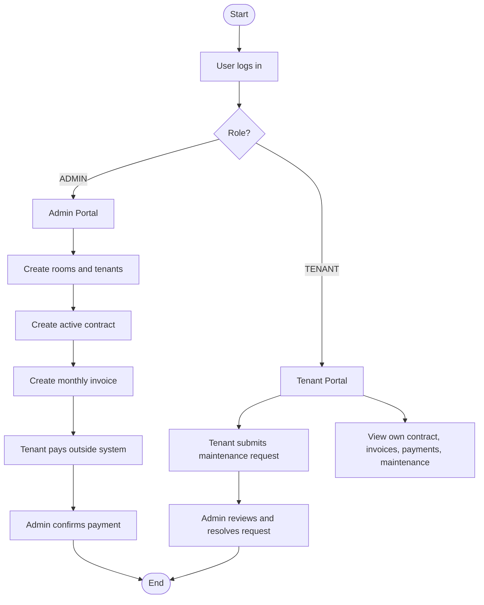

LLM-readable workflow specification:

```text
Workflow name: Overall system workflow.
Start: User opens the application and logs in.
Decision: Check user role.
If role is ADMIN:
1. Admin enters admin portal.
2. Admin creates or updates rooms and tenants.
3. Admin creates an active contract linking tenant and room.
4. System marks room as Occupied.
5. Admin creates monthly invoice.
6. Tenant pays outside the system.
7. Admin confirms payment.
8. System creates payment record and marks invoice Paid.
If role is TENANT:
1. Tenant enters tenant portal.
2. Tenant views own contract, invoices, payments, and maintenance requests.
3. Tenant may submit a maintenance request.
4. Admin reviews and resolves the request.
End.
```

### 8.2 Admin Workflow

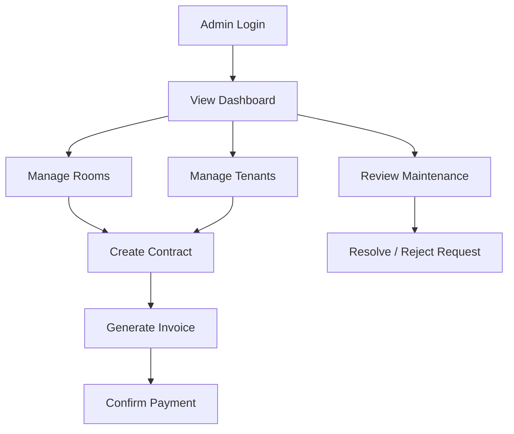

LLM-readable workflow specification:

```text
Workflow name: Admin workflow.
Steps:
1. Admin logs in.
2. Admin sees dashboard.
3. Admin manages rooms.
4. Admin manages tenants.
5. Admin creates contracts using room and tenant data.
6. Admin generates invoices from active contracts.
7. Admin confirms payments after receiving external payment.
8. Admin reviews maintenance requests.
9. Admin either rejects a request with response note or accepts and resolves it.
```

### 8.3 Tenant Workflow

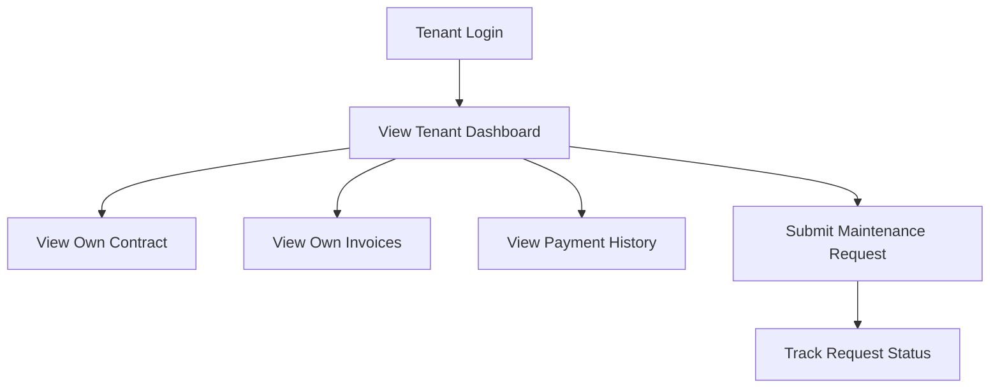

LLM-readable workflow specification:

```text
Workflow name: Tenant workflow.
Steps:
1. Tenant logs in using phone and password.
2. Tenant views personal dashboard.
3. Tenant views own contracts.
4. Tenant views own invoices.
5. Tenant views own payment history.
6. Tenant submits a maintenance request for the active rented room.
7. Tenant tracks request status and admin response.
```

## 9. State Diagrams

### 9.1 Contract Lifecycle

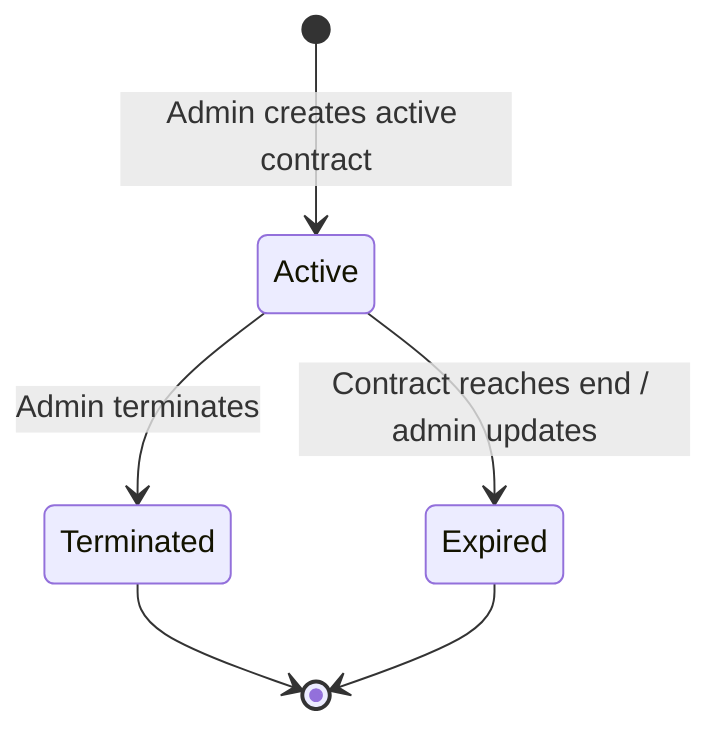

LLM-readable state diagram specification:

```text
State machine: Contract lifecycle.
States:
- Active
- Terminated
- Expired
Transitions:
- Initial state -> Active when Admin creates an active contract.
- Active -> Terminated when Admin terminates the contract.
- Active -> Expired when contract reaches end or Admin updates status.
- Terminated -> Final state.
- Expired -> Final state.
Side effects:
- Entering Active sets room status to Occupied.
- Leaving Active may set room status to Available if no other active contract exists.
```

### 9.2 Invoice And Payment Lifecycle

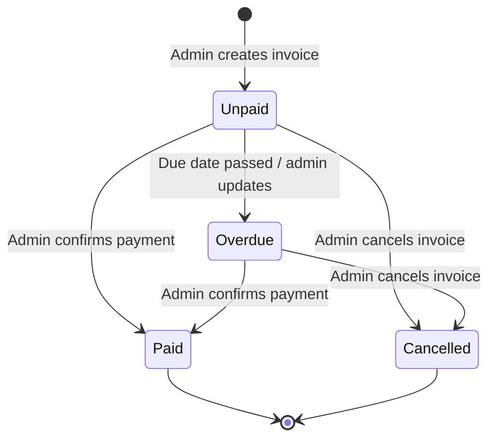

LLM-readable state diagram specification:

```text
State machine: Invoice and payment lifecycle.
States:
- Unpaid
- Overdue
- Paid
- Cancelled
Transitions:
- Initial state -> Unpaid when Admin creates invoice.
- Unpaid -> Overdue when due date passes or Admin updates status.
- Unpaid -> Paid when Admin confirms valid payment.
- Overdue -> Paid when Admin confirms valid payment.
- Unpaid -> Cancelled when Admin cancels invoice.
- Overdue -> Cancelled when Admin cancels invoice.
- Paid -> Final state.
- Cancelled -> Final state.
Business constraints:
- Paid cannot be set directly through invoice update.
- Payment confirmation must create payment record and then update invoice status to Paid.
```

### 9.3 Maintenance Request Lifecycle

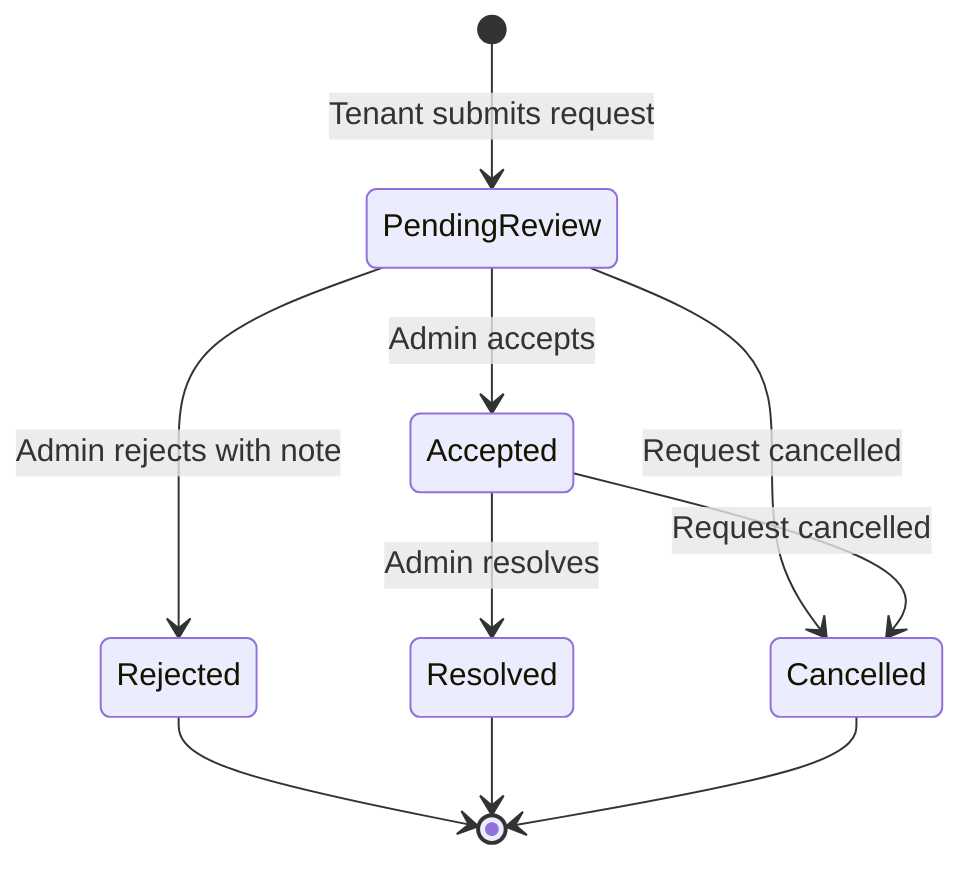

LLM-readable state diagram specification:

```text
State machine: Maintenance request lifecycle.
States:
- Pending Review
- Accepted
- Rejected
- Resolved
- Cancelled
Transitions:
- Initial state -> Pending Review when Tenant submits request.
- Pending Review -> Accepted when Admin accepts.
- Pending Review -> Rejected when Admin rejects and provides response note.
- Accepted -> Resolved when Admin finishes work and marks resolved.
- Pending Review -> Cancelled when request is cancelled.
- Accepted -> Cancelled when request is cancelled.
- Rejected -> Final state.
- Resolved -> Final state.
- Cancelled -> Final state.
Business constraints:
- Rejected requires responseNote.
- Resolved should have resolvedAt.
```

## 10. Sequence Diagrams

### 10.1 Login And Role-Based Redirect

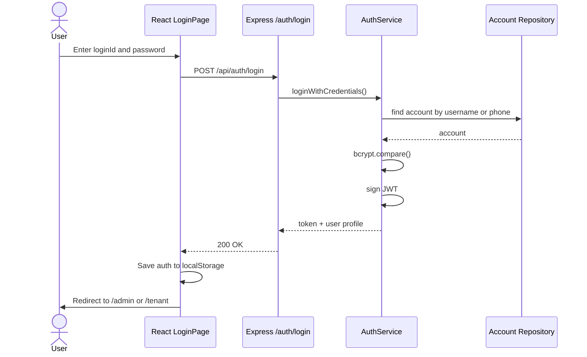

LLM-readable sequence specification:

```text
Sequence name: Login and role-based redirect.
Participants:
- User
- React LoginPage
- Express /auth/login
- AuthService
- Account Repository
Messages:
1. User enters loginId and password in React LoginPage.
2. React LoginPage sends POST /api/auth/login to Express API.
3. Express API calls AuthService.loginWithCredentials().
4. AuthService queries Account Repository by username or phone.
5. Account Repository returns account.
6. AuthService compares password using bcrypt.
7. AuthService signs JWT and returns token plus user profile.
8. Express API returns 200 OK.
9. React LoginPage stores auth object in localStorage.
10. React redirects user to /admin if role is ADMIN, otherwise /tenant.
```

### 10.2 Admin Creates Contract

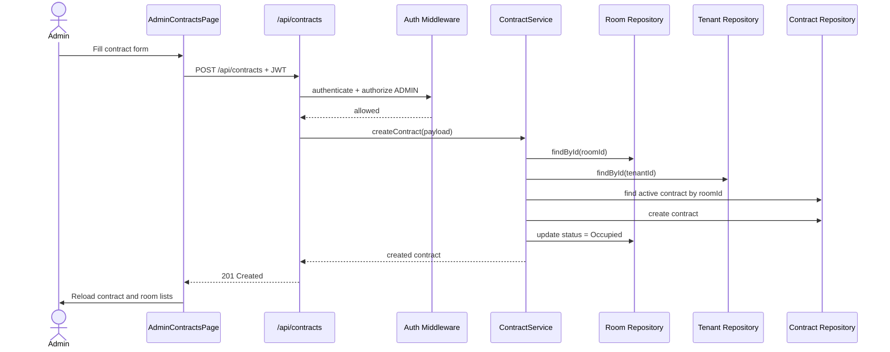

LLM-readable sequence specification:

```text
Sequence name: Admin creates contract.
Participants:
- Admin
- AdminContractsPage
- /api/contracts endpoint
- Auth Middleware
- ContractService
- Room Repository
- Tenant Repository
- Contract Repository
Messages:
1. Admin fills contract form.
2. AdminContractsPage sends POST /api/contracts with JWT.
3. API runs authenticate and authorize ADMIN.
4. API calls ContractService.createContract(payload).
5. ContractService validates date, status, deposit, and rent.
6. ContractService loads room by roomId.
7. ContractService loads tenant by tenantId.
8. ContractService checks whether another active contract exists for the room.
9. ContractService creates contract.
10. If contract is Active, ContractService updates room status to Occupied.
11. API returns created contract.
12. UI reloads contract and room data.
```

### 10.3 Admin Creates Invoice And Confirms Payment

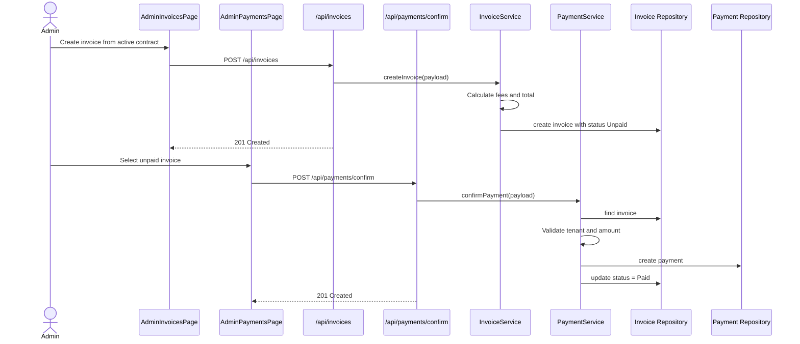

LLM-readable sequence specification:

```text
Sequence name: Admin creates invoice and confirms payment.
Participants:
- Admin
- AdminInvoicesPage
- AdminPaymentsPage
- /api/invoices endpoint
- /api/payments/confirm endpoint
- InvoiceService
- PaymentService
- Invoice Repository
- Payment Repository
Messages:
Invoice creation:
1. Admin selects active contract and enters billing data.
2. AdminInvoicesPage sends POST /api/invoices.
3. Invoice endpoint calls InvoiceService.createInvoice(payload).
4. InvoiceService validates active contract and duplicate billing month.
5. InvoiceService calculates electricity fee, water fee, and total amount.
6. InvoiceService creates invoice with status Unpaid.
7. API returns 201 Created.
Payment confirmation:
8. Admin selects unpaid invoice.
9. AdminPaymentsPage sends POST /api/payments/confirm.
10. Payment endpoint calls PaymentService.confirmPayment(payload).
11. PaymentService loads invoice.
12. PaymentService validates tenant match and exact amount match.
13. PaymentService creates payment record.
14. PaymentService updates invoice status to Paid.
15. API returns 201 Created.
```

### 10.4 Tenant Submits Maintenance Request

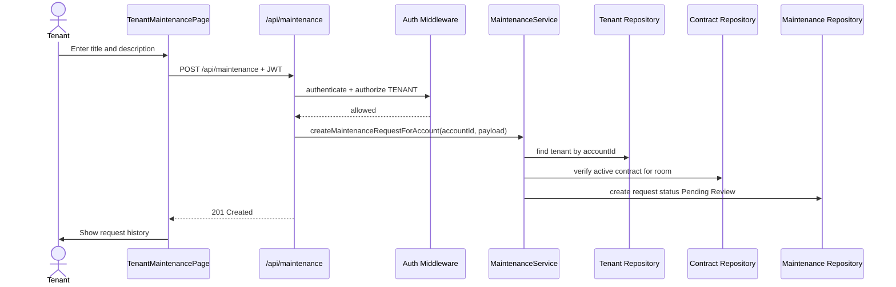

LLM-readable sequence specification:

```text
Sequence name: Tenant submits maintenance request.
Participants:
- Tenant
- TenantMaintenancePage
- /api/maintenance endpoint
- Auth Middleware
- MaintenanceService
- Tenant Repository
- Contract Repository
- Maintenance Repository
Messages:
1. Tenant enters title and description.
2. TenantMaintenancePage sends POST /api/maintenance with JWT.
3. API authenticates token and authorizes TENANT.
4. API calls MaintenanceService.createMaintenanceRequestForAccount(accountId, payload).
5. MaintenanceService finds tenant by accountId.
6. MaintenanceService verifies the selected room belongs to an active contract for that tenant.
7. MaintenanceService creates maintenance request with status Pending Review.
8. API returns 201 Created.
9. UI reloads and displays request history.
```

## 11. Activity Diagrams

### 11.1 Create Invoice Activity

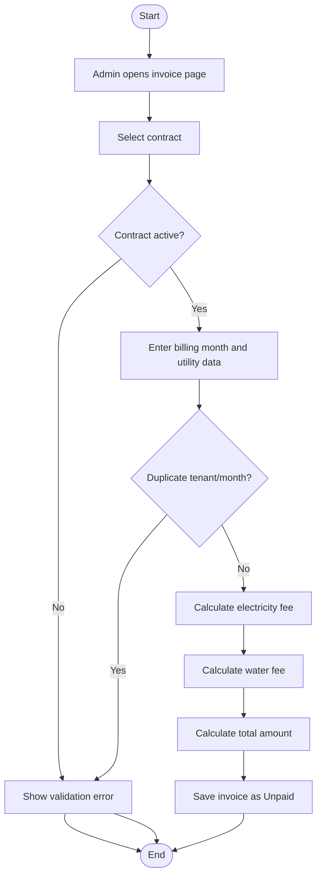

LLM-readable activity specification:

```text
Activity name: Create invoice.
Start.
1. Admin opens invoice page.
2. Admin selects contract.
Decision: Is contract active?
- No: Show validation error and end.
- Yes: Continue.
3. Admin enters billing month and utility data.
Decision: Is there duplicate invoice for same tenant and month?
- Yes: Show validation error and end.
- No: Continue.
4. System calculates electricity fee.
5. System calculates water fee.
6. System calculates total amount.
7. System saves invoice as Unpaid.
End.
```

### 11.2 Confirm Payment Activity

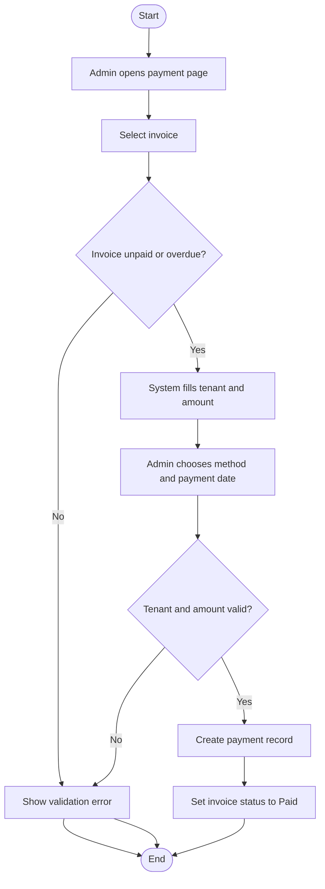

LLM-readable activity specification:

```text
Activity name: Confirm payment.
Start.
1. Admin opens payment page.
2. Admin selects invoice.
Decision: Is invoice Unpaid or Overdue?
- No: Show validation error and end.
- Yes: Continue.
3. System fills tenant and amount from invoice.
4. Admin chooses payment method and payment date.
Decision: Do tenant and amount match invoice?
- No: Show validation error and end.
- Yes: Continue.
5. System creates payment record.
6. System sets invoice status to Paid.
End.
```

### 11.3 Maintenance Review Activity

```mermaid
flowchart TD
  A([Start])
  B[Admin opens maintenance page]
  C[Select pending request]
  D{Decision}
  E[Set Accepted]
  F[Set Rejected]
  G{Response note provided?}
  H[Repair work completed]
  I[Set Resolved and cost]
  J([End])
  X[Show validation error]

  A --> B --> C --> D
  D -->|Accept| E --> H --> I --> J
  D -->|Reject| F --> G
  G -->|No| X --> J
  G -->|Yes| J
```

LLM-readable activity specification:

```text
Activity name: Maintenance review.
Start.
1. Admin opens maintenance page.
2. Admin selects pending request.
Decision: Admin accepts or rejects?
- Accept:
  1. Set request status to Accepted.
  2. Repair work is completed.
  3. Set request status to Resolved and optionally record cost.
  4. End.
- Reject:
  1. Set request status to Rejected.
  2. Decision: Is response note provided?
     - No: Show validation error and end.
     - Yes: Save rejection and end.
```

## 12. API Overview

| Module | Endpoint | Role |
| --- | --- | --- |
| Auth | `POST /api/auth/login` | Public |
| Auth | `GET /api/auth/me` | Authenticated |
| Health | `GET /api/health` | Public |
| Dashboard | `GET /api/dashboard/admin` | Admin |
| Dashboard | `GET /api/dashboard/tenant` | Tenant |
| Rooms | `GET/POST/PUT/DELETE /api/rooms` | Admin |
| Tenants | `GET/POST/PUT/DELETE /api/tenants` | Admin |
| Contracts | `GET /api/contracts/me` | Tenant |
| Contracts | `GET/POST/PUT/DELETE /api/contracts` | Admin |
| Invoices | `GET /api/invoices/me` | Tenant |
| Invoices | `GET/POST/PUT /api/invoices` | Admin |
| Payments | `GET /api/payments/me` | Tenant |
| Payments | `GET /api/payments`, `POST /api/payments/confirm` | Admin |
| Maintenance | `GET /api/maintenance/me`, `POST /api/maintenance` | Tenant |
| Maintenance | `GET /api/maintenance`, `PUT /api/maintenance/:id` | Admin |

The complete endpoint reference and business rules are maintained in `docs/API.md`.

## 13. Security Design

### 13.1 Authentication

Users log in with `loginId` and `password`.

- Admin uses `username`.
- Tenant uses `phone`.
- Password is hashed with `bcryptjs`.
- Backend returns JWT token after successful login.
- Frontend stores the token in `localStorage` under `rrm_auth`.
- Axios interceptor attaches `Authorization: Bearer <token>` to API requests.

### 13.2 Authorization

The backend uses two middleware functions:

- `authenticate`: validates JWT.
- `authorize(...roles)`: validates role access.

Tenant data isolation is enforced through service-level queries:

- `/contracts/me` finds tenant by logged-in account ID.
- `/invoices/me` returns only invoices for that tenant.
- `/payments/me` returns only payments for that tenant.
- `/maintenance/me` returns only maintenance requests for that tenant.
- Maintenance creation verifies that the selected room belongs to the tenant's active contract.

### 13.3 Current Production Hardening

- `JWT_SECRET` is required when `NODE_ENV=production`.
- `JWT_EXPIRES_IN` is configurable.
- CORS is controlled by `CLIENT_ORIGIN`.
- Request body size is limited to `100kb`.
- Security headers are set: `X-Content-Type-Options`, `X-Frame-Options`, `Referrer-Policy`.
- Central error handler avoids exposing internal stack traces.

## 14. Test Plan

### 14.1 Test Objectives

Testing should verify:

- Login and role-based redirection.
- API authorization and tenant data isolation.
- Contract, invoice, payment, and maintenance business rules.
- Dashboard statistics.
- Frontend production build.

### 14.2 System-Level Test Cases

| Test ID | Use Case | Test Description | Expected Result |
| --- | --- | --- | --- |
| TC-01 | UC-01 | Admin logs in with valid credentials | Token and role `ADMIN` are returned |
| TC-02 | UC-01 | Tenant logs in with valid credentials | Token and role `TENANT` are returned |
| TC-03 | UC-01 | User logs in with invalid password | API returns `401` |
| TC-04 | UC-04 | Admin creates valid room | Room is created |
| TC-05 | UC-05 | Admin creates valid tenant | Tenant and account are created |
| TC-06 | UC-06 | Admin creates active contract | Contract is created and room becomes `Occupied` |
| TC-07 | UC-06 | Admin creates second active contract for same room | Request is rejected |
| TC-08 | UC-09 | Admin creates valid invoice | Invoice total is calculated correctly |
| TC-09 | UC-11 | Admin confirms valid payment | Payment is created and invoice becomes `Paid` |
| TC-10 | UC-11 | Admin confirms payment with mismatched tenant | Request is rejected |
| TC-11 | UC-13 | Tenant submits maintenance request for own room | Request is created |
| TC-12 | UC-13 | Tenant submits maintenance request for another room | Request is rejected |
| TC-13 | UC-14 | Admin rejects maintenance request without note | Request is rejected |
| TC-14 | UC-03 | Admin views dashboard | Statistics are returned |

### 14.3 Existing Automated Tests

Current test file:

```text
backend/test/business-rules.test.js
```

Covered cases:

- Reject payment when tenant does not match invoice.
- Reject maintenance request when room does not belong to tenant active contract.
- Reject multiple active contracts on the same room.
- Releasing an occupied room when active contract is terminated.

Run tests:

```bash
npm test
```

Build frontend:

```bash
npm run build
```

## 15. Traceability Matrix

| Requirement | Use Case | Test Case |
| --- | --- | --- |
| FR-01, FR-02, FR-03 | UC-01 | TC-01, TC-02, TC-03 |
| FR-06, FR-07, FR-08 | UC-04 | TC-04 |
| FR-11, FR-12, FR-13 | UC-05 | TC-05 |
| FR-15, FR-17, FR-18 | UC-06, UC-07 | TC-06, TC-07 |
| FR-19, FR-20, FR-21, FR-22 | UC-09 | TC-08 |
| FR-24, FR-25, FR-26 | UC-11 | TC-09, TC-10 |
| FR-28, FR-29, FR-30, FR-31 | UC-13, UC-14, UC-15 | TC-11, TC-12, TC-13 |
| FR-32, FR-33 | UC-03, UC-16 | TC-14 |

## 16. Demo Script

### 16.1 Admin Demo

1. Log in as `admin / admin123`.
2. Open Admin Dashboard and explain statistics.
3. Open Rooms and show room inventory.
4. Open Tenants and show tenant records.
5. Open Contracts and create or edit an active contract.
6. Return to Rooms and show the room as `Occupied`.
7. Open Invoices and create a monthly invoice.
8. Open Payments and confirm payment for the invoice.
9. Return to Invoices and show invoice status as `Paid`.
10. Open Maintenance and review a tenant request.

### 16.2 Tenant Demo

1. Log out from admin.
2. Log in as `0900000001 / tenant123`.
3. Open Tenant Dashboard.
4. Open My Contract.
5. Open My Invoices.
6. Open My Payments.
7. Open My Maintenance and create a request.
8. Log back in as admin and review the request.

## 17. Current Limitations And Future Improvements

### 17.1 Current Limitations

- The system now uses MongoDB; production still needs a managed database, backup policy, and migration process.
- Contract image is stored as URL text only; there is no real file upload.
- Invoice PDF export is not implemented.
- Advanced pagination, filtering, and searching are not implemented.
- Email or SMS notifications are not implemented.
- Audit logs are not implemented.
- CI/CD pipeline is not implemented.

### 17.2 Future Improvements

Recommended improvements:

1. Add migration and backup strategy.
2. Add database indexes and monitoring for production workloads.
3. Add pagination and filtering for large lists.
4. Add audit logs for contract, invoice, payment, and maintenance changes.
5. Add PDF invoice export.
6. Add contract image/file upload.
7. Add notification for due invoices and maintenance updates.
8. Add staff or manager role if the rental business grows.

## 18. Conclusion

The current system covers the core room rental management workflow: admin manages operational data, tenant accesses a personal portal, data access is protected by role, and important business rules are enforced in the backend service layer.

The client-server architecture and controller-service-model backend structure make the system understandable and maintainable. The current implementation is suitable for a course project and local demonstration, and it now persists application data in MongoDB through Mongoose models.
